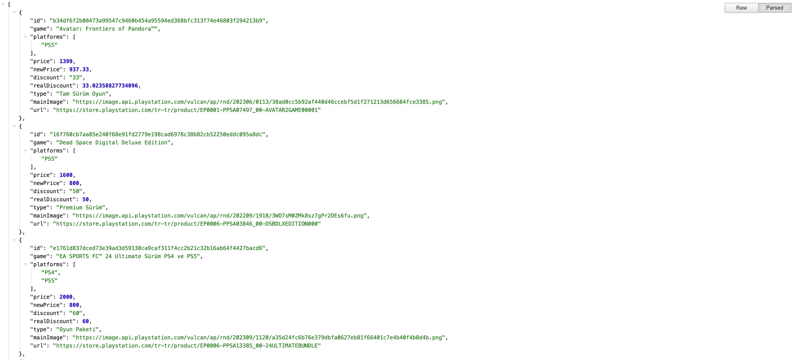

# Proje Oluşturma

---

Zustand'i uygulayabilmek için bir proje oluşturalım. Aşağıdaki komutları kullanarak Vite JS ile yeni bir proje oluşturabilirsiniz. Bu örnek, React ile TypeScript kullanımını içermektedir.

    npm create vite@latest

Projeyi oluşturduktan sonra, ilgili dizine gidin ve bağımlılıkları yükleyin:

    cd zustand-tutorial
    npm install

Son olarak, projenizi VSCode ile açmak için şu komutu kullanabilirsiniz:

    code .

Projede Tailwind CSS ve DaisyUI kullanıldığı belirtilmiş. Eğer bu kütüphaneleri henüz kurmadıysanız, [Tailwind CSS](https://tailwindcss.com/docs/installation) ve [DaisyUI](https://daisyui.com/docs/install/) dökümanlarından kurulum adımlarını takip edebilirsiniz.

Demo projemiz için ise verileri local bir json dosyasından kullandık. Bunu api olarak kullanabilmek için json-server kurulumu yapabilirsiniz. Bunun için aşağıdaki komutu kullanabilirsiniz:

    npm install json-server,

Daha sonra package.json dosyasına aşağıdaki komutu ekleyin. Bu komut db.json dosyanızı local bir api haline getirecektir. (db.json dosyası root dizinde bulunmalıdır.)

        "db": "npx json-server db.json"

Ardından `npm run db` komutu ile json-server'ı başlatabilirsiniz. Bu komut çalıştığı zaman tarayıcınızda aşağıdaki gibi bir çıktı göreceksiniz.

